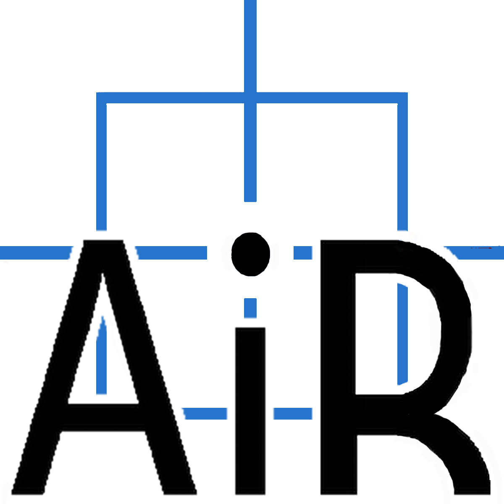
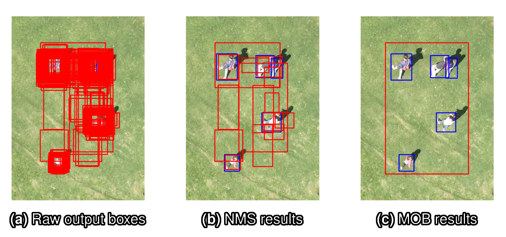
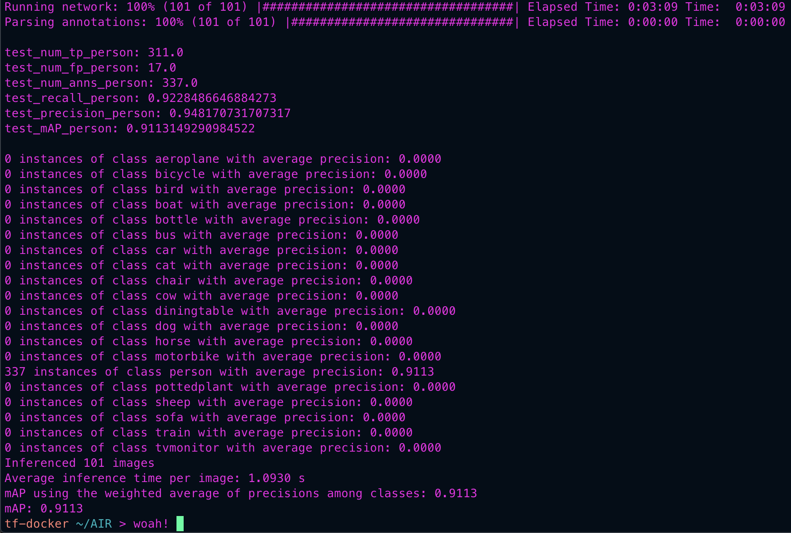

<br>


# AIR: Aerial Inspection RetinaNet for supporting Land Search and Rescue Missions

[](https://zenodo.org/badge/latestdoi/426364043) [](https://hub.docker.com/repository/docker/intrinsick/keras-retinanet-gpu)

AIR is a deep learning based object detection solution to automate the aerial drone footage inspection task frequently carried out during search and rescue (SAR) operations with drone units. It provides a fast, convenient and reliable way to augment aerial, high-resolution image inspection for clues about human presence by highlighting relevant image regions with bounding boxes, as done in the image below. With the assistance of AIR, SAR missions with aerial drone searches can likely be carried out much faster before, and with considerably higher success rate.

This code repository is based on the master's thesis work by **Pasi Pyrrö** <span itemscope itemtype="https://schema.org/Person"><a itemprop="sameAs" content="https://orcid.org/0000-0002-0277-4996" href="https://orcid.org/0000-0002-0277-4996" target="orcid.widget" rel="me noopener noreferrer" style="vertical-align:top;"></a></span> from [Aalto University, School of Science](https://www.aalto.fi/en/school-of-science) with the title "AIR: Aerial Inspection RetinaNet for Land Search and Rescue Missions". This thesis work was funded by Accenture.

<br><br>

## Key features
- Supports both video and images
- Highly accurate deep learning detector custom built for this application
- Decent processing speed despite the high-resolution images and a very deep neural network used
- Supports object tracking with kalman filter
- Implements the novel MOB bounding box postprocessing algorithm
- Implements the SAR-APD evaluation algorithm for real-world, value-oriented metric reporting in SAR aerial person detection applications
- Plethora of options for customization (e.g., in bounding box postprocessing, image preprocessing, speed vs accuracy trade-offs, etc.)

## Results on HERIDAL test set

In the table below are listed the results of the AIR detector and other notable state-of-the-art methods on the [HERIDAL](http://ipsar.fesb.unist.hr/HERIDAL%20database.html) test set. Note that the FPS metric is a rough estimate based on the reported inference speed and hardware setup by the original authors, and should be taken as mostly directional. We did not test any of the other methods ourselves.

| Method  | Precision  | Recall  | AP  | FPS  |
|---|---|---|---|---|
| Mean shift segmentation method [[1](#references)]|  18.7 | 74.7 | - | -
|  Saliency guided VGG16 [[2](#references)] | 34.8 | 88.9 | - | - 
|  Faster R-CNN [[3](#references)] |  67.3 | 88.3 | **86.1** | **1** 
|  Two-stage multimodel CNN [[4](#references)] |  68.9 | **94.7** | - | 0.1 
|  SSD [[4](#references)] | 4.3 | 94.4 | - | -
|  AIR with NMS (ours) | **90.1** | 86.1 | 84.6 | **1**

It turns out AIR achieves state-of-the-art results in precison and inference speed while having comparable recall to the strongest competitors!

You can check out the full details of AIR evaluation in this [Wandb report](https://wandb.ai/hypersphere/masters-thesis/reports/Best-Model-Evaluation-Study--Vmlldzo1MDgxODE).

## Bounding Box Aggregation options

<br>

AIR implements both NMS and MOB algorithms for bounding box prediction postprocessing. The image above shows the main difference: MOB (c) merges bounding boxes (a) instead of eliminating them like NMS (b). Thus, choosing MOB can produce visually more pleasing predictions. Moreover, MOB is less sensitive to the choice of condifence score threshold, making it more robust under unseen data. AIR also comes with a custom SAR-APD evaluation scheme that truthfully ranks MOB-equipped object detector performance (as standard object detection metrics, such as VOC2012 AP, do not like MOB very much).

Should you choose MOB postprocessing and SAR-APD evaluation, you should see similar evaluation results (e.g., after running `bash evaluate.sh`)

<br>

All metrics increased by over 4 percentage points from NMS & VOC2012 results with no loss of prediction visual quality, neat!

## Hardware Requirements
- x86 or x64 processor architecture (at least for the Docker installation, and if trying to install natively on ARM64 architecture, expect a lot of compiling python packages from source)
- NVIDIA® GPU with CUDA® capability 3.5 or higher (recommended)
- ~8 GB of RAM or more

## Software Requirements

If using containers:
- [Docker](https://www.docker.com/) or [Singularity](https://singularity.hpcng.org/) container system

If using native installation:
- Python 3.6
- `pip` and `setuptools`
- FFmpeg (recommended)
- Linux or Mac OS (not tested on Windows)

## Quick install instructions using Docker
- Clone this repo
- Either start docker CPU environment by running: `bash start-air-cpu-env.sh docker`
- Or start docker GPU environment by running: `bash start-air-gpu-env.sh docker`
- Inside docker container, build the AIR project by running: `python setup.py build_ext --inplace`

## Quick install instructions using Singularity
- Clone this repo
- You might wanna specify your `SINGULARITY_CACHEDIR` env variable prior to installation, if so edit the shell scripts used in the next steps
- Either start docker CPU environment by running: `bash start-air-cpu-env.sh singularity`
- Or start docker GPU environment by running: `bash start-air-gpu-env.sh singularity`
- Go to mounted directory by typing `cd AIR`
- Build the AIR project by running: `python setup.py build_ext --inplace`

## Quick native install instructions 
- Clone this repo 
- To build the AIR project for CPU, run the command: `/usr/bin/python3 -m pip install air-detector[cpu]`
- To build the AIR project for GPU, run the command: `/usr/bin/python3 -m pip install air-detector[gpu]`

## Download data and the trained model
- Save the [demo image folder](https://zenodo.org/record/5662638) under `data/images`
- Save the [demo videos](https://zenodo.org/record/5662512) under `data/videos`
- Save the [trained model](https://zenodo.org/record/5662168) in `models/` folder
    - In the project root, convert the training model to inference model by running: `/bin/bash convert-model.sh`
- Optionally, you can download and extract [the whole HERIDAL dataset in keras-retinanet format](https://zenodo.org/record/5662351) to `data/datasets`

## Quick demos

Once everything is set up (installation and asset downloads), you might wanna try out these cool and simple demos to get the hang of using the AIR detector.

### Running inference on HERIDAL test image folder
- In the project root, run the command: `/bin/bash infer.sh`
- Check `data/predictions/dauntless-sweep-2_resnet152_pascal-enclose-inference/` folder for the output images

### Evaluating AIR performance on HERIDAL test set (can be slow on CPU)
- In the project root, run the command: `/bin/bash evaluate.sh`
- Check `data/predictions/dauntless-sweep-2_resnet152_pascal-enclose-sar-apd-eval/` folder for the output images

### SAR-APD video detection with image output
- In the project root, run the command: `/bin/bash convert-model.sh`
- Then start the inferencing by running: `/usr/bin/python3 video_detect.py -c mob_cpu_images`
- Check `data/videos/Ylojarvi-gridiajo-two-guys-moving_air_output/` folder for the output images

### SAR-APD video detection with video output
- In the project root, run the command: `/bin/bash convert-model.sh`
- Then start the inferencing by running: `/usr/bin/python3 video_detect.py -c mob_gpu_tracking`
- Check `data/videos/Ylojarvi-gridiajo-two-guys-moving_air_output_compressed.mov` output video

## Wandb support
- AIR uses experiment tracking software by [Weight & Biases](https://wandb.ai/home)
- Wandb enables you to view [the whole public experimentation record for AIR](https://wandb.ai/hypersphere/masters-thesis/overview)
- AIR experiments can be controlled with the following environment variables:
    - `WANDB_MODE="disabled"`
        - disables all wandb functionality, required if not logged in to wandb
    - `WANDB_MODE="dryrun"`
        - wandb logging works as normal, but nothing is uploaded to cloud
    - `WANDB_API_KEY=<your_api_key>`
        - needed to interact with wandb web UI, you might want to put this in your ``~/.bashrc`` or ``~/.zshrc`` so that it's automatically included into the Docker envs. On most linux based systems, you can achieve this by running this shell command with your Wandb API key:
            ```bash
            echo "export WANDB_API_KEY=<your_api_key>" >> "~/.${SHELL/\/bin\//}rc"; exec $SHELL
            ```
    - `WANDB_DIR=~/wandb`
        - select where local log files are stored
    - `WANDB_PROJECT="air-testing"`
        - select your wandb cloud project
    - `WANDB_ENTITY="ML-Mike"`
        - select your wandb account username
    - `WANDB_RUN_GROUP="cool-experiments"`
        - Semantic group within a project to log experiments runs to
- More info in [wandb documentation](https://docs.wandb.ai/guides/track/advanced/environment-variables#optional-environment-variables) (not all env variables are supported though)
 
## Project folder structure

- **airutils:** air utility functions that augment the standard `keras-retinanet` framework to incorporate *aerial person detection* (APD) support to it.
- **config:**  configuration files for `video_detect.py` script (easier to use than the CLI in most cases)
- **data:** input and output data for the AIR detector, divided into subfolders:
    - `/datasets` (input for training and evaluation) 
    - `/images` (input for general inference)
    - `/predictions` (output of the AIR detector)
    - `/videos` (input for `video_detect.py`)
- **keras-retinanet:** a fork of the [keras-retinanet](https://github.com/fizyr/keras-retinanet) repository with some AIR modifications
- **models:** contains trained object detection models (both trainable and inference models)

## General toubleshooting
- Try setting the `AIR_VERBOSE=1` enviroment variable to see full TF logs
- If using docker, make sure you're allocating enough memory for the container (like at least 8 GB)
- If some script simply gets "killed", it's a clear indicator that you have too little memory allocated
- Tracker options in `video_detect.py` might need to be recalibrated for each use case for best performance
- If you edit any of the bash scripts in the root folder (e.g., `evaluate.sh`), make sure there are no whitespace after linebreaks '`\`', bash can be picky about these things... Also avoid commenting out any command line parameters in those scripts, just delete the whole line outright
- The actual python scripts corresponding to the bash scripts are in `keras_retinanet/keras_retinanet/bin` folder and they can be called directly (or you can try the installed console scripts (e.g., `air-evaluate`) if you ran `pip install .`) with approproate parameters (examples can be found in those bash scripts)
- Using the command line parameter `-h` or `--help` usually *helps* (pun intended)
- If you find a bug or have a complicated question, open a new issue here

## Acknowledgements
- Kudos to [Aalto Science-IT project](https://scicomp.aalto.fi/) for providing the compute hardware for training and testing the AIR detector
- Big thanks to contributors of [keras-retinanet](https://github.com/fizyr/keras-retinanet), and their marvellous programming efforts that have allowed AIR to exists in the first place!
- Huge credit to the authors of the [HERIDAL](http://ipsar.fesb.unist.hr/HERIDAL%20database.html) dataset [[2](#references)], for which AIR equally well owes its very existence 
- Also thanks to Ari Nissinen from Finnish Voluntary Rescue Service ([VAPEPA](https://vapepa.fi/en/)) for providing video material used in development and testing of the AIR detector
- Lastly, thanks to Hassan Naseri from Accenture for instructing with the thesis work and providing valuable insights throughout the whole AIR project

## How to cite

```bibtex
@MastersThesis{pyrro2021air, 
	title={{AIR:} {Aerial} Inspection RetinaNet for Land Search and Rescue Missions}, 
	author={Pyrr{\"o}, Pasi and Naseri, Hassan and Jung, Alexander},
	school={Aalto University, School of Science},
	year={2021}
}
```

## Licenses
- AIR is licensed under the [Apache 2.0 License](./LICENSE)
- HERIDAL data is licensed under the [Creative Commons Attribution 3.0 Unported (CC BY 3.0) License](https://creativecommons.org/licenses/by/3.0/)
- Demo videos and the trained model are licensed under the [Creative Commons Attribution 4.0 International (CC BY 4.0) License](https://creativecommons.org/licenses/by/4.0/)


## References

[1] TURIC, H., DUJMIC, H., AND PAPIC, V. Two-stage segmentation of aerial
images for search and rescue. *Information Technology and Control 39*, 2 (2010).

[2] BOŽIC-ŠTULIC, D., MARUŠIC, Ž., AND GOTOVAC, S. Deep learning approach in
aerial imagery for supporting land search and rescue missions. *International Journal of Computer Vision 127*, 9 (2019), 1256–1278.

[3] MARUŠIC, Ž., BOŽIC-ŠTULIC, D., GOTOVAC, S., AND MARUŠIC, T. Region
proposal approach for human detection on aerial imagery. In *2018 3rd International Conference on Smart and Sustainable Technologies (SpliTech)* (2018), IEEE, pp. 1–6.

[4] VASIC, M. K., AND PAPIC, V. Multimodel deep learning for person detection in aerial images. *Electronics 9*, 9 (2020), 1459.